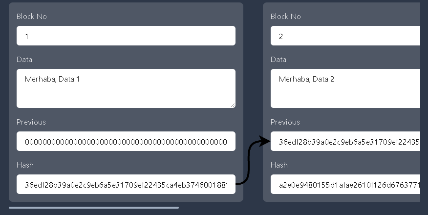

# Blockchain Basics


## Hashing the data

A hash is essentially a summary of the original data.

Bitcoin uses SHA (Secure Hash Algorithm)-256 hash. SHA-256 is an algorithm that simply turns any kind of data into a standard-size (256 bits) hash. One input always generates the same hash, but it is impossible to predict the input back from the hash.


```
Hello Hash
```

```

6529ead5a42d94dcf8416b9192a6ae25c1700c006b4ef71ea7b4a67b34532996

```

* Hashing enables us to efficiently compare whether data is changed. Many structures in the blockchain will be built using hashing.

* 2²⁵⁶ different inputs to find the matching hash, which is a lot of calculations and there is no such computational power in the world.

## Block

A block is simply a container for data - it groups data together. The “data” can be anything digital — an image, a book, property records, or a history of monetary transactions (i.e. a ledger).

* When we want to add new blocks, we will just chain the new ones at the end of the previous one. Surprisingly simple, right?

* This way, we will create consecutive dependencies between blocks.




## Single chains


