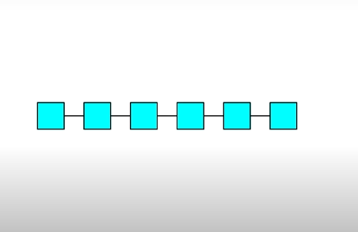
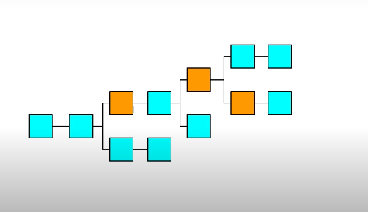
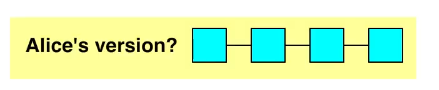
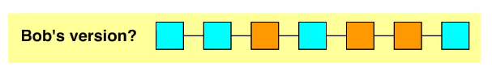
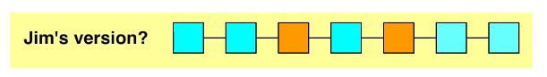
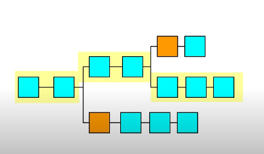
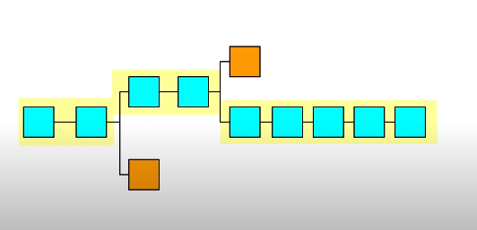
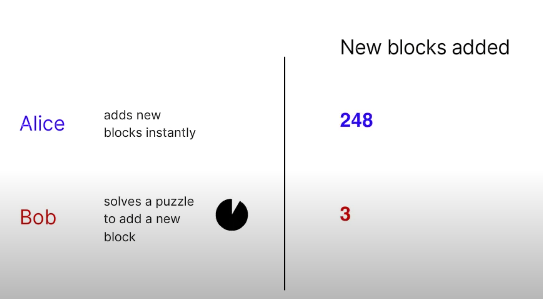

# Blockchain Basics


## Hashing the data

A hash is essentially a summary of the original data.

Bitcoin uses SHA (Secure Hash Algorithm)-256 hash. SHA-256 is an algorithm that simply turns any kind of data into a standard-size (256 bits) hash. One input always generates the same hash, but it is impossible to predict the input back from the hash.


```
Hello Hash
```

```

6529ead5a42d94dcf8416b9192a6ae25c1700c006b4ef71ea7b4a67b34532996

```

* Hashing enables us to efficiently compare whether data is changed. Many structures in the blockchain will be built using hashing.

* 2²⁵⁶ different inputs to find the matching hash, which is a lot of calculations and there is no such computational power in the world.

## Block

A block is simply a container for data - it groups data together. The “data” can be anything digital — an image, a book, property records, or a history of monetary transactions (i.e. a ledger).

* When we want to add new blocks, we will just chain the new ones at the end of the previous one. Surprisingly simple, right?

* This way, we will create consecutive dependencies between blocks.


## Single Chains

Remember: Our goal is to build a system where individuals can add data and collectively agree which data is the “truth” without a central authority deciding the truth.

We now know that data can be kept in a blockchain where blocks of data are connected to each other with hashing.

We can keep growing a single chain by adding new blocks of data




## Distributed Chains

A distributed system can have conflicting versions




## Which chain represents the truth?

Once there are multiple versions of a blockchain, how can we say which one is the truth? Each copy of the blockchain that represents a different version may be the true version.







### Making the longest chain the “true” blockchain

In this distributed system, we need to introduce some mechanisms for the “true” blockchain to emerge.

There are two fundamental, interdependent tweaks we will implement. We will make it faster to add blocks that are truthful and we will then assume the longest chain is the most truthful chain for the network to use (We have a good reason for that, as we’ll explain in the next section ☝️).


1. If you enable truthful blocks to be added more quickly, you can make more truthful blockchains 

Then, the longest chain will be the most truthful chain



2. If new blocks only get added to the longest blockchain this further supports the longest and the most truthful blockchain




## Why do we need mining?

To make sure that the “true” blocks will be added faster, we can introduce a few dynamics to the blockchain.

First, we will make it time consuming to add new blocks by forcing computers to solve a difficult puzzle to create a new block.

* If you ask computers to solve a time-consuming puzzle, you can regulate how fast new blocks get added



### Multiple computers working on the puzzle

Second, if more computers try to solve the puzzle simultaneously and the first one solving the puzzle shares the solution with others, it can be solved more quickly simply because more computers are putting effort into it. So, ``the version of blocks that more computers work on gets added faster``.
