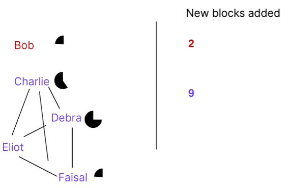
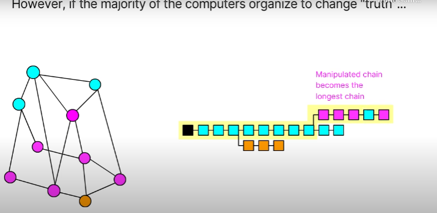
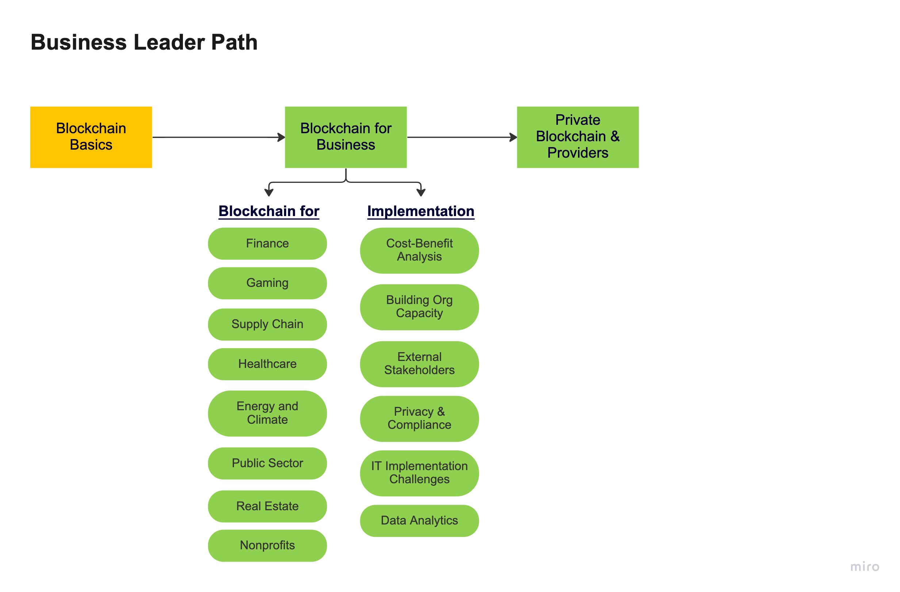
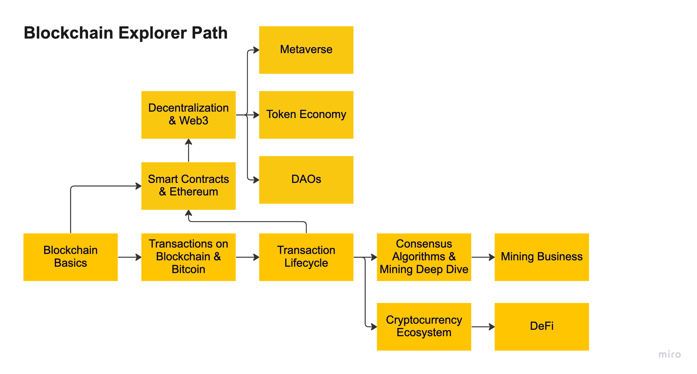
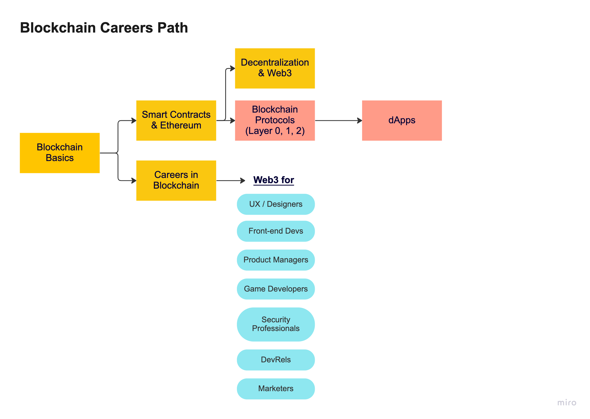

# Blockchain Basics


## Hashing the data

A hash is essentially a summary of the original data.

Bitcoin uses SHA (Secure Hash Algorithm)-256 hash. SHA-256 is an algorithm that simply turns any kind of data into a standard-size (256 bits) hash. One input always generates the same hash, but it is impossible to predict the input back from the hash.


```
Hello Hash
```

```

6529ead5a42d94dcf8416b9192a6ae25c1700c006b4ef71ea7b4a67b34532996

```

* Hashing enables us to efficiently compare whether data is changed. Many structures in the blockchain will be built using hashing.

* 2²⁵⁶ different inputs to find the matching hash, which is a lot of calculations and there is no such computational power in the world.

## Block

A block is simply a container for data - it groups data together. The “data” can be anything digital — an image, a book, property records, or a history of monetary transactions (i.e. a ledger).

* When we want to add new blocks, we will just chain the new ones at the end of the previous one. Surprisingly simple, right?

* This way, we will create consecutive dependencies between blocks.


## Single Chains

Remember: Our goal is to build a system where individuals can add data and collectively agree which data is the “truth” without a central authority deciding the truth.

We now know that data can be kept in a blockchain where blocks of data are connected to each other with hashing.

We can keep growing a single chain by adding new blocks of data


## Distributed Chains

A distributed system can have conflicting versions


## Which chain represents the truth?

Once there are multiple versions of a blockchain, how can we say which one is the truth? Each copy of the blockchain that represents a different version may be the true version.


### Making the longest chain the “true” blockchain

In this distributed system, we need to introduce some mechanisms for the “true” blockchain to emerge.

There are two fundamental, interdependent tweaks we will implement. We will make it faster to add blocks that are truthful and we will then assume the longest chain is the most truthful chain for the network to use (We have a good reason for that, as we’ll explain in the next section ☝️).


1. If you enable truthful blocks to be added more quickly, you can make more truthful blockchains 

Then, the longest chain will be the most truthful chain


2. If new blocks only get added to the longest blockchain this further supports the longest and the most truthful blockchain


## Why do we need mining?

To make sure that the “true” blocks will be added faster, we can introduce a few dynamics to the blockchain.

First, we will make it time consuming to add new blocks by forcing computers to solve a difficult puzzle to create a new block.

* If you ask computers to solve a time-consuming puzzle, you can regulate how fast new blocks get added


### Multiple computers working on the puzzle

Second, if more computers try to solve the puzzle simultaneously and the first one solving the puzzle shares the solution with others, it can be solved more quickly simply because more computers are putting effort into it. So, ``the version of blocks that more computers work on gets added faster``.




* They solve puzzles faster

As a result, whatever the majority of the computers in the network agree on is added faster and the longest chain contains these blocks.

## 51% Attack

If the majority of computers working on the blockchain are honest and they’re not organized together to change the data, a bad actor won’t be able to manipulate the data. They’ll have no way to catch up with the speed of the longest blockchain and their blockchain will not be valid.

What happens if the majority of computers (at least 51%) are coordinated with each other and they know exactly which data to manipulate? Then, they can solve the puzzles faster, build a longer chain and create an alternate truth. `This is the only way to ‘hack’ a blockchain (also called a 51% attack)`




If the blockchain is long enough, it’s almost impossible to go back and change data in previous blocks. Because, then, the hash of the block changes, which requires changing hashes of all subsequent blocks. Solving this puzzle takes too much time — there would be no way to catch up with the newly added blocks to create the longest chain.

## Sumary

Blockchain is designed to enable distributed, decentralized systems to agree on the same version of data.

The data is entered into blocks and, with new material, blocks are chained together as a blockchain. The data on each block is stamped with a hash algorithm and the blocks are chained together using the hash of the previous block.

This blockchain is shared by different computers, called nodes, but because it is a decentralized system, the computers may start producing conflicting versions of the blockchain.

To prevent this, the system requires every node to mine the block as they are added to the blockchain. A node needs to guess a nonce number for a block that produces a hash number.

Because it is a guessing game, the more nodes that try to guess the same version of the block, the faster they are mined. The system also forces nodes to build on top of the longest chain, which further enforces alignment on the longest chain. As a result, the longest chain becomes the reliable and agreed version of data.

Even though it is possible to hijack the blockchain and inject an alternative version of the data, as the chain gets longer and as more nodes join the network, it becomes increasingly difficult to do so.

This way, a decentralized system can collectively build an agreed-upon version of the data and facilitate relationships or information flows between different players without a centralized authority.


* f you would like to become a blockchain or web3 developer, you can learn more about transactions, smart contracts, decentralized applications, and programming languages specifically written for blockchain and decentralized apps (e.g. Solidity).


* 👩‍💼 If you would like to better understand how you can take advantage of the blockchain for your business, you can learn more about the different use cases for blockchain and how you can address implementation challenges.





* 👩‍🚀 If you would like to further understand how blockchain evolved and the new things it enabled, you can learn more about cryptocurrencies, token economics, decentralization and web3




* 👩‍🎨 If you would like to see how your current skill sets can lead to a career in the blockchain field, you can learn more about the career opportunities in blockchain and web3.




 Thank you!
